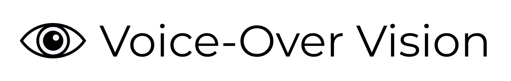
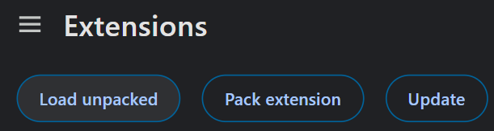

<div align="center" style="margin-bottom:20px">
    
</div>

<p align="center">
 <a href="#🎬-demos">Demos</a> •
 <a href="#🚀-features">Features</a> •
 <a href="#💻-installation">Installation</a> •
 <a href="#🌟-contribution">Contribution</a> • 
 <a href="#💎-acknowledgments">Acknowledgments</a> • 
 <a href="#📄-citation">Citation</a>
</p>

## Voice-Over Vision: The future of the internet is accessible
We present **Voice-Over Vision**, a tool that transforms YouTube watching for the visually impaired, making every video more accessible and enjoyable. Like a friend sitting next to you, this Chrome Extension narrates the unseen parts of a video, filling in the blanks where audio alone falls short. It smartly sifts through videos, picking out details that you might miss otherwise, and uses text-to-speech technology to bring those visuals to life through vivid descriptions. With Voice-Over Vision, every story is fully told, ensuring everyone gets the complete picture, no matter what.

## 🎬 Demos

**Demos comming soon!**

## 🚀 Features

- **Real-Time Audio Description**: Generates audio descriptions for YouTube videos, offering a comprehensive viewing experience for visually impaired users.
- **Ask The Video**: Answers questions about the video at any time. With just the click of a button (or a keyboard shortcut), the video pauses and a chat opens to clarify any and all questions about the video!
- **More comming soon!**

<details>
<summary>Work In Progress</summary>

* [ ] **Customizable Speech Parameters**: Adjust voice selection, speech rate, and volume to tailor the audio descriptions to your preferences.
* [ ] **Detail Level Settings**: Choose the level of detail for descriptions, from basic overviews to in-depth analysis of physical appearances and emotions.
* [ ] **Interruption Frequency Control**: Select how often you'd like the video's original audio to be interrupted with descriptions, ensuring a balanced experience.
  </details>

## 💻 Installation

Instructions on how to install and run Voice-Over Vision (soon to be released at Google Chrome Extensions marketplace)

### Prerequisites

- Google Chrome or any Chromium-based browser.
- Clone of the [back-end repository](https://github.com/voice-over-vision/vov-backend).

### Steps

#### 1. **Clone the repository**: 
```
git clone https://github.com/voice-over-vision/vov-chrome-extension.git
```
   
#### 2. **Run the back-end server**: Navigate to the [back-end repository](https://github.com/guilherme-francisco/winter_hackaton_backend) and follow the instructions to get it running on `localhost:8000`.
   
#### 3. **Load the extension in Chrome** (detailed information [here](https://developer.chrome.com/docs/extensions/get-started/tutorial/hello-world#load-unpacked)):
   - Open the _Manage Extensions_ page by navigating to [chrome://extensions/](chrome://extensions/) in your Chrome browser.
  </br>
   - Enable _Developer mode_ by toggling the switch at the top-right corner.
  </br>
   - Click on _Load unpacked_ and select the directory of your cloned repository.
  </br>
   - The extension should now be installed and visible in your Extensions list, you can pin it if you want by clicking the Pin icon.
  </br>

## 🌟 Contribution

<table>
  <tbody>
    <tr>
      <td align="center" width=15%>
        <a href="https://github.com/DaviGiordano">
          
          </br>
          <sub><b>Davi Giordano</b></sub>
        </a>
        <br />
      </td>
      <td align="center" width=15%>
        <a href="https://github.com/guilherme-francisco">
          
          <br />
          <sub><b>Guilherme Mariano</b></sub>
        </a>
        <br />
      </td>
      <td align="center" width=15%>
        <a href="https://github.com/marianaserrao">
          
          <br />
          <sub><b>Mariana Serrão</b></sub>
        </a>
        <br />
      </td>
      <td align="center" width=15%>
        <a href="https://github.com/murillo-teixeira">
          
          <br />
          <sub><b>Murillo Teixeira</b></sub>
        </a>
        <br />
      </td>
    </tr>
  </tbody>
</table>

## 💎 Acknowledgments

### Chroma DB
We extend our heartfelt thanks to the developers and community behind Chroma DB for their exceptional AI-native open-source embedding database, a crucial component in our mission to create an accessibility tool for the visually impaired. ChromaDB's robust and efficient data management capabilities have been pivotal in our efforts to make a positive impact.

### GPT-4
Our appreciation goes to the OpenAI team for providing foundational AI technology for our project. The robustness of GPT-4 was instrumental for our project's natural language processing and image processing capabilities.

## 📄 Citation

```bibtex
@software{voice-over-vision,
  author = {Davi Giordano, Guilherme Mariano, Mariana Serrao and Murillo Teixeira},
  title = {Voice-Over Vision: slogan},
  month = {March},
  year = {2024},
  url = {https://github.com/voice-over-vision}
}
```